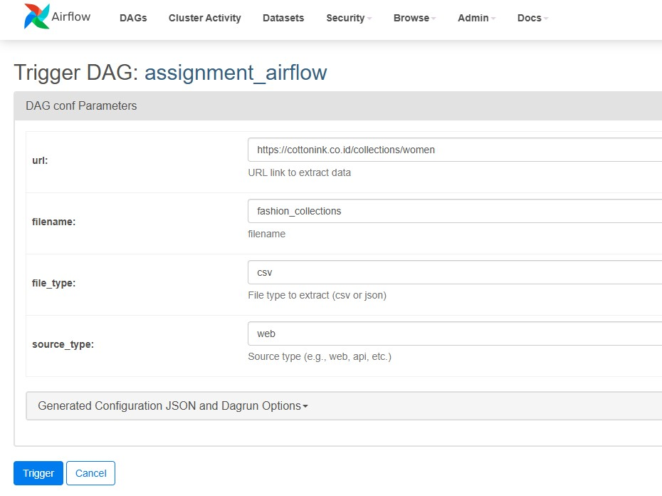
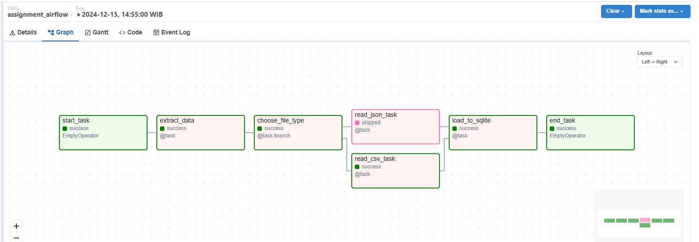
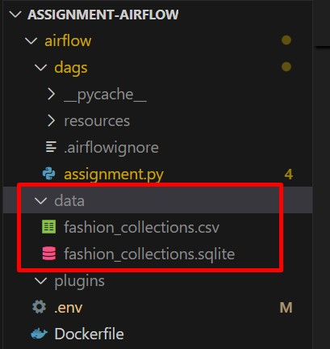
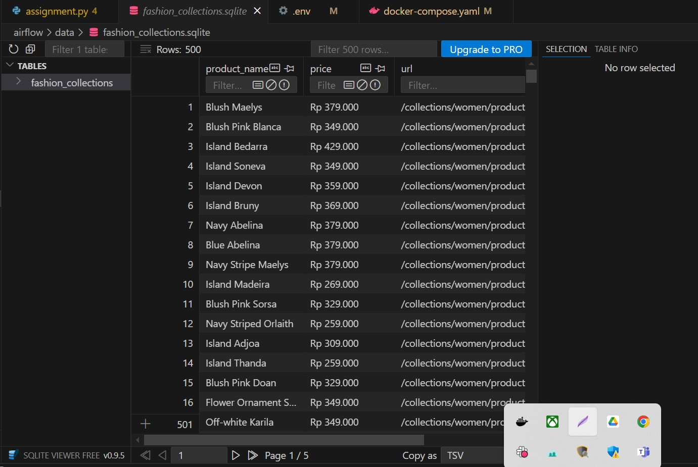

# Simple EL Application with Apache Airflow

This project demonstrates a simple Extract-Load (EL) process using Apache Airflow, where data is extracted from various sources, processed, and loaded into a SQLite database.

## Description

In this project:
- Data is extracted from Cotton Ink website (https://cottonink.co.id/collections/women) and stored as CSV files in the staging area (`data/` folder).

- The extraction process is controlled using Airflow's **Run Config Parameters** to specify which extraction task to run and from which source.

- Each type of file (CSV, etc.) is extracted using a different task. The **BranchOperator** is used to select which extraction task to run based on the configuration.

- After extraction, the data is loaded into a SQLite database.

## Files

- `assignment.py`: Contains the logic for the Airflow DAG that handles the EL process.
- `image/`: Folder containing images related to the project.